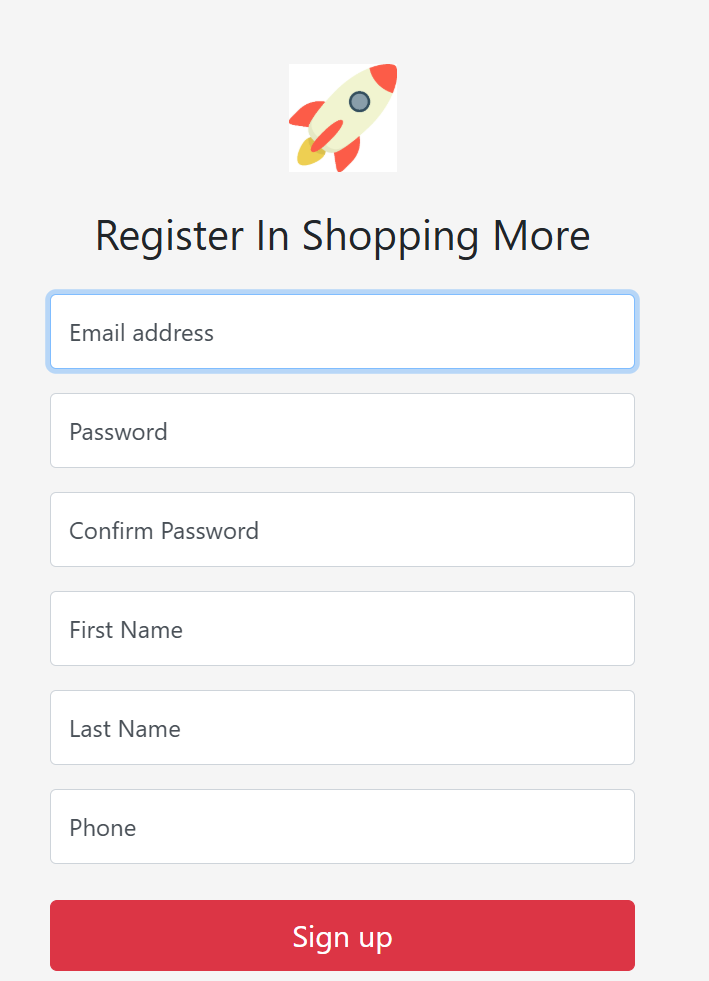
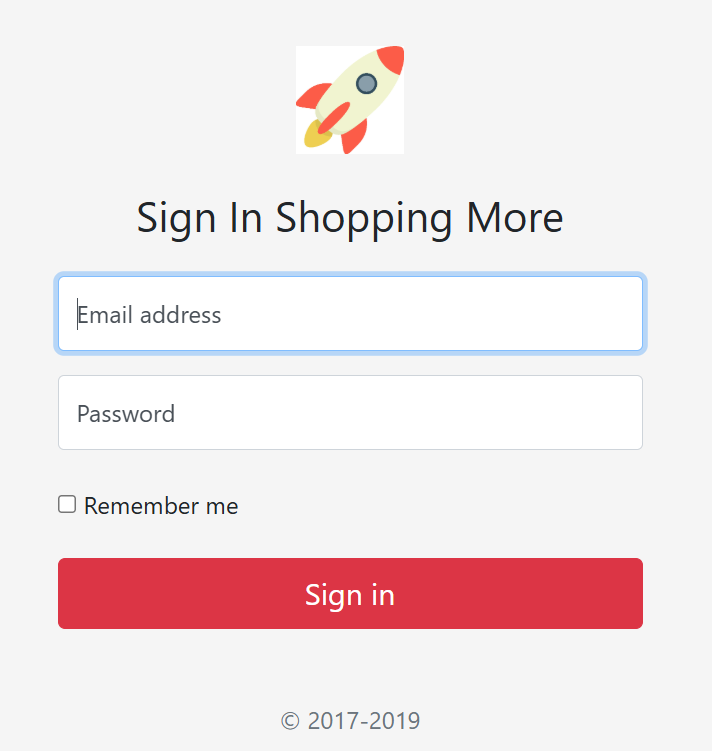
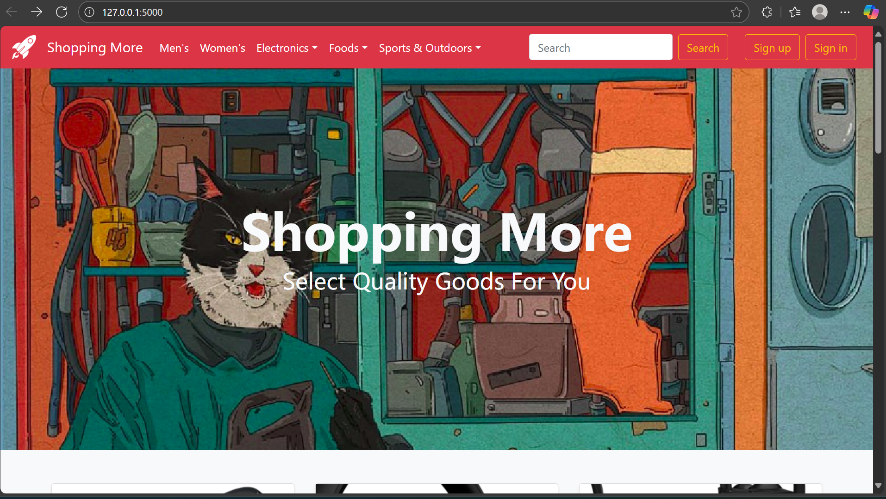
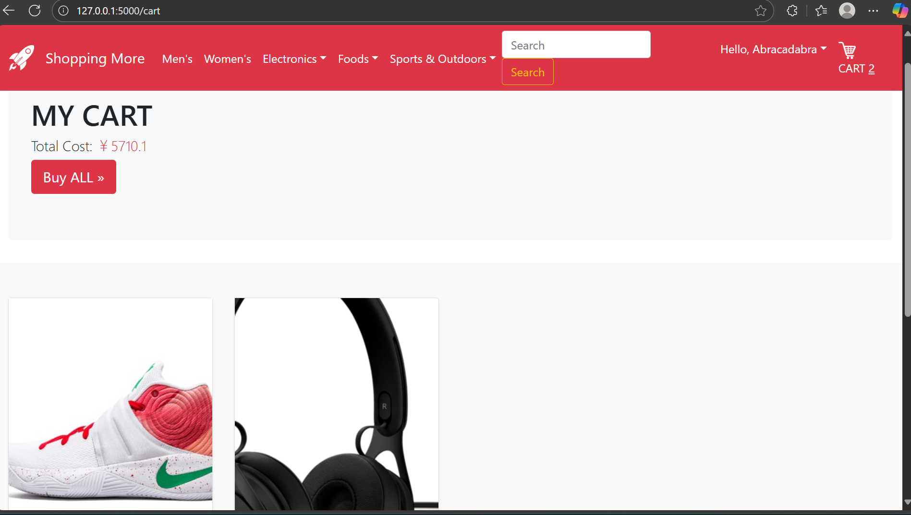
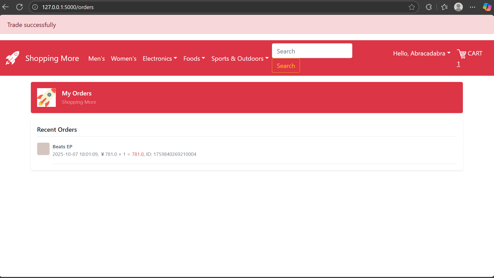
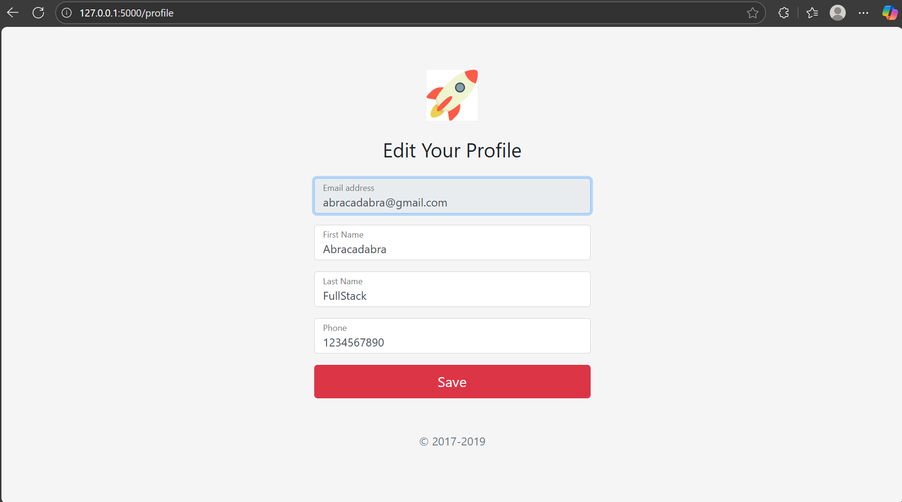

# E-Commerce Web Application

This is a full-stack e-commerce web application built with Flask, SQLite, and Bootstrap. The application allows users to browse products, add them to cart, place orders, and manage their profile.

## Features

- User authentication (register, login, logout)
- User profile management
- Password change functionality
- Product browsing by categories
- Shopping cart management
- Order placement and tracking
- Admin panel for product management (add/remove products)
- Responsive design using Bootstrap

## Technologies Used

- **Backend**: Flask (Python)
- **Database**: SQLite
- **Frontend**: HTML, CSS, JavaScript, Bootstrap
- **Authentication**: Session-based with password hashing (MD5)
- **File Handling**: Werkzeug for secure file uploads

## Project Structure

```
├── app.py                  # Main application file
├── database.db             # SQLite database
├── database.py             # Database setup and initialization
├── requirements.txt        # Project dependencies
├── static/                 # Static files (CSS, JS, images)
│   ├── css/                # Stylesheets
│   ├── img/                # Images
│   ├── js/                 # JavaScript files
│   └── uploads/            # Product images uploaded by admin
└── templates/              # HTML templates
    ├── add.html            # Add product page (admin)
    ├── base.html           # Base template
    ├── cart.html           # Shopping cart page
    ├── display.html        # Product display page
    ├── index.html          # Homepage
    ├── login.html          # Login page
    ├── order.html          # Order page
    ├── password.html       # Change password page
    ├── profile.html        # User profile page
    ├── register.html       # Registration page
    └── remove.html         # Remove product page (admin)
```

## Demo Steps

### 1. User Registration and Login

1. Open the application in your browser
2. Click on "Register" in the navigation bar
3. Fill in the registration form with your details
4. Submit the form to create your account
5. You will be redirected to the login page
6. Enter your email and password to log in




### 2. Browsing Products

1. After logging in, you'll be directed to the homepage
2. Browse products displayed on the homepage
3. Click on category names to filter products by category
4. Click on a product to view its details



### 3. Shopping Cart Management

1. When viewing a product, click "Add to Cart" to add it to your shopping cart
2. Click on the cart icon in the navigation bar to view your cart
3. Adjust quantities using the "+" and "-" buttons
4. Remove items by clicking the "Remove" button
5. View the total price of all items in your cart



### 4. Placing Orders

1. From your shopping cart, click "Place Order" for individual items or "Place All Orders" for all items
2. Confirm your order
3. View your order history by clicking on "Orders" in the navigation bar



### 5. User Profile Management

1. Click on your name in the navigation bar
2. Select "Profile" to view and edit your profile information
3. Update your details and save changes
4. To change your password, select "Change Password" from the dropdown menu



### 6. Admin Functions (Product Management)

1. Access the admin panel by navigating to "/add" URL
2. Add new products by filling in the product details and uploading an image
3. Remove products by navigating to "/remove" URL and selecting products to remove


## Working of the Project

This e-commerce application follows a typical web application architecture:

1. **User Authentication**: 
   - Users can register with their email, name, and password
   - Passwords are hashed using MD5 before storing in the database
   - Session-based authentication is used to maintain user login state

2. **Product Management**:
   - Products are organized by categories
   - Each product has details like name, price, description, image, and stock
   - Admin can add new products and remove existing ones

3. **Shopping Cart**:
   - Users can add products to their cart
   - Cart items are stored in the database
   - Users can adjust quantities or remove items from the cart

4. **Order Processing**:
   - Orders are created from cart items
   - Each order has a unique ID generated based on timestamp
   - Order history is maintained for each user

5. **Database Structure**:
   - Users table: Stores user information
   - Products table: Stores product details
   - Categories table: Stores product categories
   - Kart table: Stores shopping cart items
   - Orders table: Stores order information

6. **Security Features**:
   - Password hashing
   - Secure file uploads
   - Session management
   - URL validation to prevent open redirects

## Installation and Setup

1. Clone the repository
2. Install the required dependencies:
   ```
   pip install -r requirements.txt
   ```
3. Initialize the database:
   ```
   python database.py
   ```
4. Run the application:
   ```
   python app.py
   ```
5. Access the application in your browser at `http://127.0.0.1:5000`
